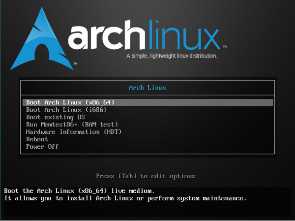
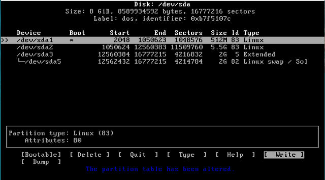
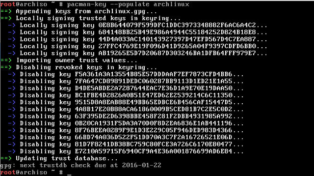
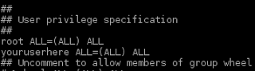

## Installation Guide (Arch Linux)

Before you start using Arch, you'll first need to [download it](https://www.archlinux.org/download/) on your system.

Once downloaded, when loading the operating system, the installation process offers several options. In my case, I have chosen the 64-bit version, if your processor is older, then your choice is i686. Now, let's start with the steps!

* We must load our keyboard, which by default the system has the US layout configured
> (**Note:** Only if you don't have an US keyboard layout)

    ~~~
	# For Spain
    loadkeys es.map.gz
    # or for Latin America
    loadkeys la-latin1
    ~~~

* To partition the disk and mount it, we'll use 'cfdisk'
> (**Important:** The label must be 'dos')
    
    ~~~
	cfdisk
    ~~~

* When partitioning has been completed, we'll use the EXT4 format for the two data partitions

    ~~~
	mkfs.ext2 /dev/sda1
	mkfs.ext4 /dev/sda2
    ~~~

* For the transactional partition we'll use the `mkswap` command and activate it with the `swapon` command

    ~~~
    mkswap /dev/sda5
    swapon /dev/sda5
    ~~~

* At this point, we can mount the partitions

    ~~~
    mount /dev/sda2 /mnt
    mkdir /mnt/boot
    mount /dev/sda1 /mnt/boot
    ~~~

* For the installation we will use the script `pacstrap`
> (**Note:** The process can be somewhat slow, it depends on our connection and the specifications of our computer. We'll also install the program 'networkmanager', to make it easier for us to manage the network connection)

    ~~~
    pacstrap /mnt base base-devel
    pacstrap /mnt networkmanager
    ~~~

* Before going on to the following step, we'll update Arch's system ***keys***

    ~~~    
    pacman-key --init
    pacman-key --populate archlinux
    ~~~

> *A sample of the process*

* Let's set up the system. First, create the table 'fstab', where we'll indicate the mount points

    ~~~
    genfstab -U -p /mnt >> /mnt/etc/fstab
    ~~~

* We locate ourselves in the system as root

    ~~~
    arch-chroot /mnt /bin/bash
    ~~~

* Generate the name of the system to send it to the folder */etc/hostname*
> (**Important:** {nameofthesystem} substitute for the name whatever we want for our system)

    ~~~
    echo {nameofthesystem} > /etc/hostname
    ~~~

* Create a shortcut with the `ln` command to the time zone file

    ~~~
    ln -s /usr/share/zoneinfo/Europe/Madrid /etc/localtime
    ~~~

* We must uncomment the languages we want to use in */etc/locale.gen*. To generate it, we'll use `locale-gen`

    ~~~
    nano /etc/locale.gen
        // inside the file
        #es_ES.UTF-8 => es_ES.UTF-8     # uncomment line

        // Save & Exit with ^X & Yes

    nano /etc/locale.conf
        // inside the file
        LANG=es_ES.UTF-8    # write line

        //Save & Exit with ^X & Yes

    locale-gen
    ~~~

* Indicate local preferences

    ~~~
    export LANG=es_ES.UTF-8

    // Make sure of changes
    echo $LANG
    ~~~

* Let's now define the layout of the keyboard. For this we will create the file */etc/vconsole.conf*
    
    ~~~
    nano /etc/vconsole.conf

    // Add to the file the following
    # For Spain
    KEYMAP=es
    # or for Latin America
    KEYMAP=la-latin1
    ~~~

* Generate the Kernel configuration

    ~~~
    mkinitcpio -p linux
    ~~~

* After the process finishes (it may take a while), we must create the root password, typing the command `passwd`

    ~~~
    passwd
    ~~~

* Now install GRUB

    ~~~
    pacman -S grub
    grub-mkconfig -o /boot/grub/grub.cfg
    grub-install --recheck /dev/sda
    ~~~

* We get out of ChRoot
    
    ~~~
    exit
    ~~~

* Unmount partitions

    ~~~
    umount -R /mnt
    ~~~

* And then restart

    ~~~
    reboot
    ~~~

---

### After Arch installation

After rebooting, we'll choose *Boot existing OS* option, and then, 
*Arch Linux* option. Once SHELL has been loaded again, we must log in as root. Now that we have the system installed we must take some essential steps. 

1. Create a regular user, that is, different from root
> (**Important:** {nameoftheuser} substitute for the name whatever we want for our user)

    ~~~
    useradd -m -g users -G wheel -s /bin/bash {nameoftheuser}
    passwd {nameoftheuser}
    ~~~

2. Add the new user to the group *sudoers*
> (**Important:** {nameoftheuser} substitute for the name whatever we want for our user)  
> · It goes here:  
> 

    ~~~
    nano /etc/sudoers

    // and write
    {nameoftheuser} ALL=(ALL) NOPASSWD: ALL
    ~~~

3. **Network Activation** If you remember we have installed the program 'networkmanager', now we have to use it. Run and activate it as follows:

    ~~~
    systemctl start NetworkManager.service
    systemctl enable NetworkManager.service
    ~~~

    > **Note:** If we have a problem with the network we can consult the [network configuration page](https://wiki.archlinux.org/index.php/Network_configuration_%28Espa%C3%B1ol%29), in Spanish

4. **Desktop Installation**
    1. First of all, we must install [X.Org Server](https://es.wikipedia.org/wiki/X.Org_Server)
    
        ~~~
        # Xorg Packages
        pacman -S xorg-xinit
        pacman -S xorg-server xorg-server-utils xorg-utils xorg-apps
        pacman -S xorg-twm xorg-xclock xterm
        pacman -S xf86-video-fbdev [and/or] pacman -S xf86-video-vesa
        // because xf86-video-intel isn't loading the vesa and/or fbdev modules even though Udev is supposed to do that all automatically now without an Xorg.conf...

        # Install additional fonts
        pacman -S ttf-dejavu ttf-droid ttf-inconsolata
        ~~~

    2. Install ***i3*** desktop
    
        ~~~
        pacman -Syy i3-wm i3status i3lock dmenu termite dunst nitrogen
        // i3-wm: window manager | i3status: monitor status panel | i3lock: lockscreen | dmenu: application launcher | termite: terminal emulator | dunst: notificator | nitrogen: wallpaper generator

        nano ~/.xinitrc
            // inside the file, add this line [or] this line instead:
            exec i3 [or] exec i3 -V >> ~/i3log-$(date +'%F-%k-%M-%S') 2>&1

        nano ~/.config/i3/config
            // inside the file, add this line
            exec --no-startup-id setxkbmap -layout es   # load keyboard layout 'es'
        ~~~

    3. Once installed if we type in the console `startx`, we can already see the desktop:
        ~~~
        startx

        /*
        A message will appear asking you to create a configuration file in $HOME, or if you want to create the file manually. Press Enter to create the file in $HOME which will be hosted in the following path: ~/.config/i3/config.

        Then it will show another message that requests that we define that command key we want to use: Windows or Alt, in my case I selected the Windows key.
        

        For more information, please visit: [i3wm UnOfficial Guide](http://lasventanasenmosaico.blogspot.com.es/2016/05/instalar-y-configurar-i3wm-en-archlinux.html)
        */
        ~~~
      

